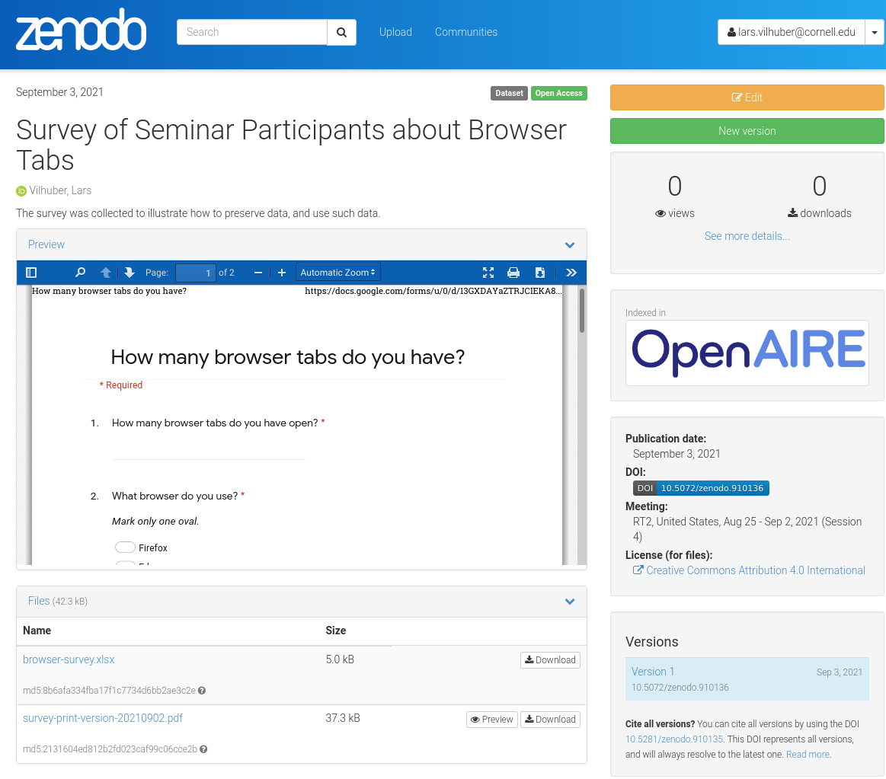
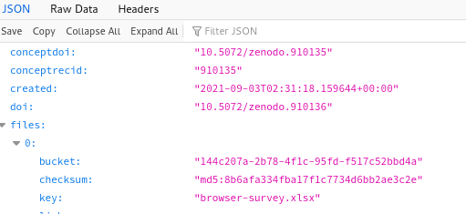
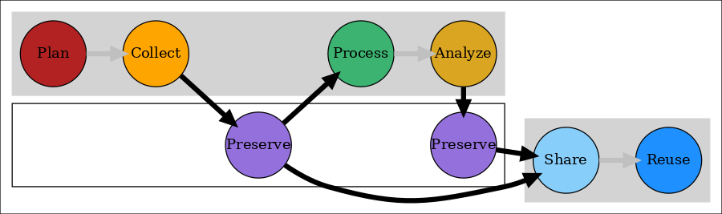

Data Sharing and Archiving for Reproducibility (RT2 2021): Part 2
========================================================
author: Lars Vilhuber
date: 2021-09-03
autosize: true
width: 1200

Cornell University


Previously
==========


- Survey forms - ✔️✔️
- Metadata - ✔️✔️
- Sample data - ✔️✔️
- Actual data

***




Result
======


>  Goal 1: Be able to curate the data necessary for reproducible analysis

We have archived sample data and provenance information (survey form) in a reliable location. ✔️

> Goal 2: Know when to do so

We did so at the earliest possible moment. ✔️


Next step
=========
type: prompt


- Collect data
- Update archive

***


- Use preserved data
- Analyze data


Update the data
===========
type: section


<div style="text-align: center;">

</div>

using the  [Google Sheet with updated Survey data](https://docs.google.com/spreadsheets/d/141okmmX_P8bLvZ_K1uA-yBicKqS9rBm8DgUXi2Sa6f0/edit?usp=sharing)


Publish the data
===========
type: section


<div style="text-align: center;">

</div>

at the [Zenodo deposit https://sandbox.zenodo.org/record/910136](https://sandbox.zenodo.org/record/910136) (this one only works for the presenter)

Using the data
==============
type: section

<center>

</center>

Adding configuration information
===============================
We can now use the following information to augment the replication:


```r
# Zenodo DOI prefix for Sandbox
zenodo.prefix <- "10.5072/zenodo"
# Specific ID for my deposit - resolves to a latest version!
zenodo.id <- "910135"
# We will recover the rest from Zenodo API
zenodo.api = "https://sandbox.zenodo.org/api/records/"
```


(Behind the scenes)
==================
We will parse the information that Zenodo gives us through an API:

> https://sandbox.zenodo.org/api/records/910135

<div style="text-align: center;">

</div>


Automating the data acquisition
==========================


```r
# needs rjson, tidyr, dplyr
```
We download the metadata from the API (to see what this looked like **before** we made any changes, see [this version in the Github repository](https://github.com/labordynamicsinstitute/tutorial-data-sharing-archiving-2021/blob/d3714700ce7e1758ac75d0ac07b730e421935333/data/metadata.json))

```r
download.file(paste0(zenodo.api,zenodo.id),destfile=file.path(dataloc,"metadata.json"))
```
We read the JSON in:

```r
latest <- fromJSON(file=file.path(dataloc,"metadata.json"))
```
We get the links to the actual XLSX files (and the Survey):

```r
file.list <- as.data.frame(latest$files) %>% select(starts_with("self")) %>% gather()
```


Automating the data acquisition
==========================

We download all the xlsx files, by looking whether the filename has `xlsx` in it:

```r
for ( value in file.list$value ) {
	print(value)
	if ( grepl("xlsx",value ) ) {
	    print("Downloading...")
	    file.name <- basename(value)
	    download.file(value,destfile=file.path(workpath,basename(value)))
	} else {
	  print("Skipping.")
	}
}
```

```
[1] "https://sandbox.zenodo.org/api/files/144c207a-2b78-4f1c-95fd-f517c52bbd4a/browser-survey.xlsx"
[1] "Downloading..."
[1] "https://sandbox.zenodo.org/api/files/144c207a-2b78-4f1c-95fd-f517c52bbd4a/survey-print-version-20210902.pdf"
[1] "Skipping."
```


Re-use of our own archive
=================================

Now that we have downloaded our own archival version of the survey, we can use it:


```r
browser_survey <- read_excel(file.path(workpath,"browser-survey.xlsx"))
```

We should also preserve WHICH version we are actually using:


```r
# The deposit ID always points to the latest version, but we want to identify which version that is:
latest.doi <- latest$doi
latest.doi
```

```
[1] "10.5072/zenodo.910136"
```

Crosstab
========


```r
browser_survey %>% 
  group_by(`What browser do you use?`) %>%
  summarize(`How many browser tabs do you have open?`) -> table
```


Result
======
type: prompt


<center>

Table: Browser tabs by browser type.

|What browser do you use? | How many browser tabs do you have open?|
|:------------------------|---------------------------------------:|
|Firefox                  |                                      51|

 Source: https://doi.org/10.5072/zenodo.910136,<br/>
 created 2021-09-03T02:31:18.159644+00:00.
</center>

Lessons learned
===============



- Goal 1: Be able to curate the data necessary for reproducible analysis ✔️
- Goal 2: Know when to do so ✔️
- Goal 3: Choose license (while respecting ethics)

***

 

or [latest!](https://doi.org/10.5072/zenodo.910135)


Next steps
==========
- [Making your research re-usable - licenses](index3.html)
- [Archiving your research code](index4.html)


Conclusion
==========


Thank you
==========
type: section

Presentation: https://labordynamicsinstitute.github.io/tutorial-data-sharing-archiving-2021

Source: https://github.com/labordynamicsinstitute/tutorial-data-sharing-archiving-2021
