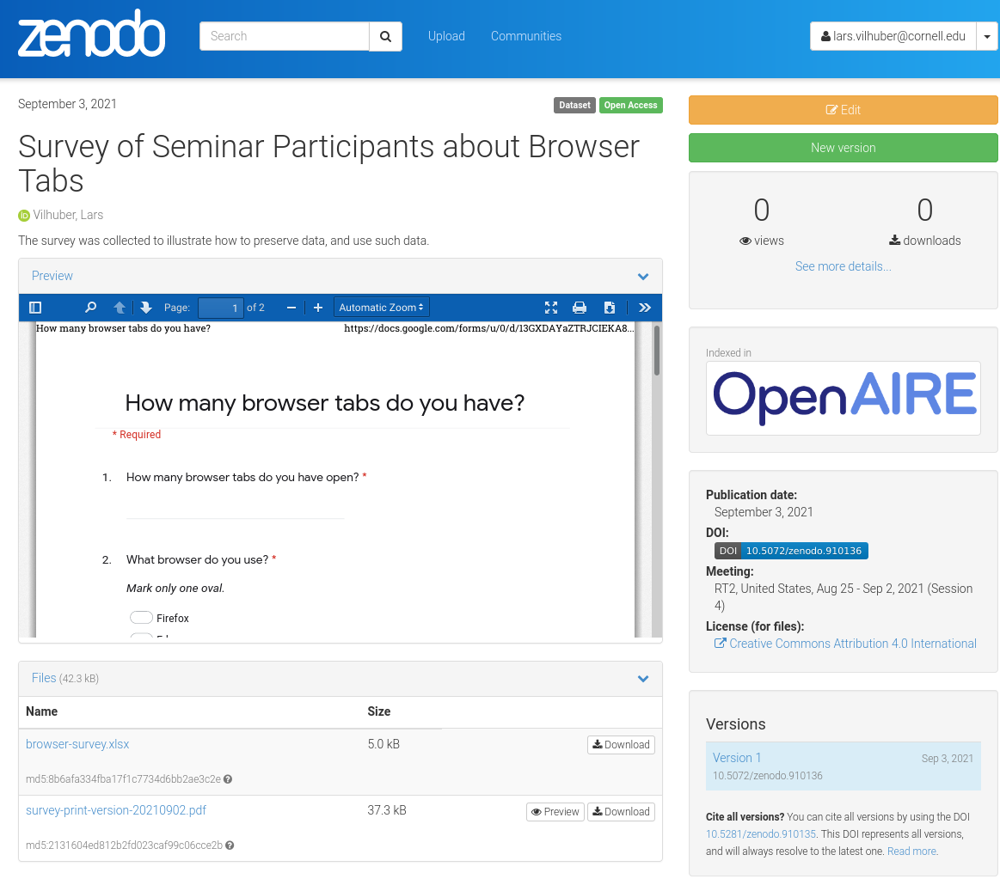
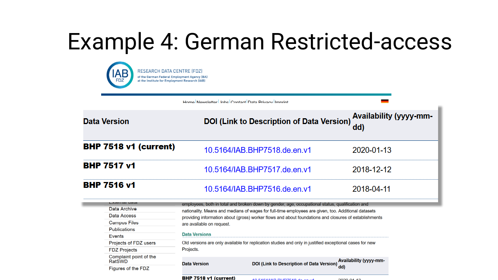
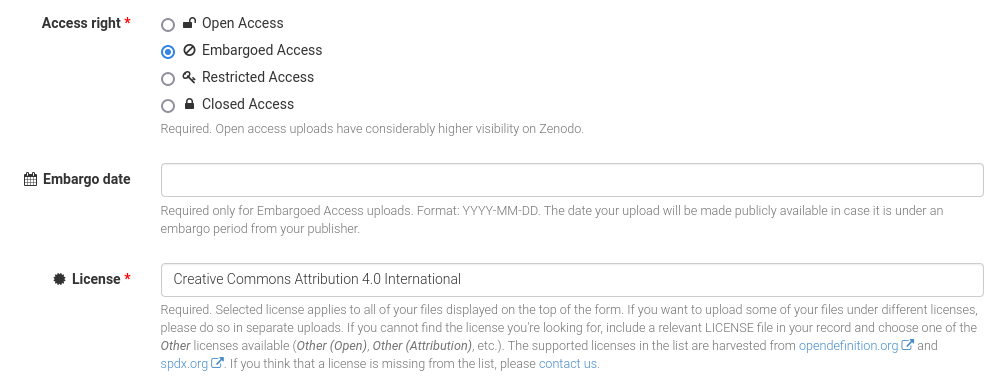
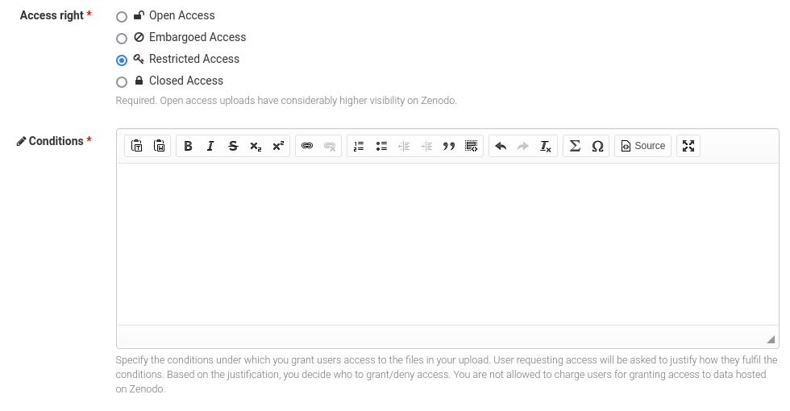
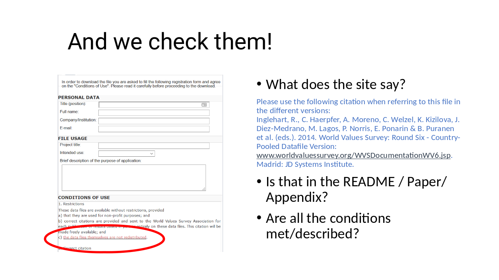

Data Sharing and Archiving for Reproducibility (RT2 2021): Part 3
========================================================
author: Lars Vilhuber
date: 2021-09-03
autosize: true
width: 1200

Cornell University

Previously
==========

- Survey forms - ✔️✔️
- Metadata - ✔️✔️
- Sample data - ✔️✔️
- Actual data - ✔️✔️

***

Lessons learned
===============

- Goal 1: Be able to curate the data necessary for reproducible analysis ✔️
- Goal 2: Know when to do so ✔️
- Goal 3: Choose license (while respecting ethics)

***

Next:

Balancing multiple ethical priorities
====================================

Maximizing openness

***

Preserving privacy of respondents 

A previous example
=================

IAB: [Establishment History Panel (BHP) - Version 7518 v1](https://doi.org/10.5164/IAB.BHP7518.de.en.v1) at [https://doi.org/10.5164/IAB.BHP7518.de.en.v1](https://doi.org/10.5164/IAB.BHP7518.de.en.v1)

***

Access conditions involve application process.

But information ABOUT the access process (=metadata) is available.

Options for you
===============

We will use the example of Zenodo to illustrate the various options, but many other repositories have such options.

***

Embargo
=======

[Zenodo embargo](https://about.zenodo.org/policies/):

> "**Embargo status**: Users may deposit content under an embargo status and provide and end date for the embargo. The repository will restrict access to the data until the end of the embargo period; at which time, the content **will become publically available automatically**."

(in the case of openICPSR, all the contents are visible, but files are not downloadable)

***

Restricted
==========

[Zenodo restricted access](https://about.zenodo.org/policies/):

> "**Restricted Access**: Users may deposit restricted files with the ability to share access with others if certain requirements are met. These files will not be made publicly available and sharing will be made possible only *by the approval of depositor* of the original file."

***

Restricted (openICPSR)
==========

[openICPSR restricted access](https://www.openicpsr.org/openicpsr/accessRD):

> "Users can then apply for access to those restricted data using the **ICPSR Data Access Request System (IDARS)**, through which applicants agree to follow strict legal and electronic requirements for maintaining data confidentiality. "

Important: It is ICPSR that approves the access, not the depositor, subject to a standard set of requirements.

***

Closed access
=============

[Zenodo closed access](https://about.zenodo.org/infrastructure/)

> "Zenodo allows users to upload files under closed access. *Closed access means that zenodo.org users will not be able to access the files you uploaded.* The files are however stored unencrypted and may be viewed by Zenodo operational staff under specific conditions. This means that “closed access” on Zenodo is not suitable for secret or confidential data."

***

De facto, only you (not even your colleagues) can access the data. 

Licenses
========
type: section

Licenses
=========

- Licenses provide (automatic) permissions to users of the data. 
- By default, posted data are copyrighted (in the United States), and users gain no rights (just because you can download them does not give you additional rights)
  - in particular, users are often restricted from redistributing them!
  

***

Some guidance:

- [Cornell's Research Data Management Service Group](https://data.research.cornell.edu/content/intellectual-property)
- Stodden, Victoria. "[Enabling Reproducible Research: Open Licensing For Scientific Innovation](http://web.stanford.edu/~vcs/papers/ijclp-STODDEN-2009.pdf)", *International Journal of Communications Law and Policy*, Issue 13, 2009.
- Bitlaw.com, "[Database Legal Protection](https://www.bitlaw.com/copyright/database.html#compilations), accessed at [https://www.bitlaw.com/copyright/database.html#compilations](https://www.bitlaw.com/copyright/database.html#compilations) on Sept 12, 2019.

Licenses and Reproducibility
============================

For the purpose of replicability, journals will usually insist on an open license that allows for replication by researchers unconnected to the original parties, to the extent allowed by other agreements and the law.
  - For data-only repositories, possible licenses include the  [Creative Commons Attribution 4.0 International Public License](http://creativecommons.org/licenses/by/4.0/) or the more liberal
 [CC0 1.0 Universal (CC0 1.0) Public Domain Dedication]
  - For code-only repositories, possible licenses include  [3-Clause (Modified) BSD Clause](https://opensource.org/licenses/BSD-3-Clause), though other open-source licenses are equally acceptable (see [https://opensource.org/licenses](https://opensource.org/licenses)). "Code" or "Software" is any statements or instructions to be used directly or indirectly in a computer in order to bring about a certain result, and may include interpretive, object or source code. The CC-BY license is [not recommended for software](https://creativecommons.org/faq/#Can_I_apply_a_Creative_Commons_license_to_software.3F).

Dual-License Setup
==================

Many repositories contain both code and databases. In that case, the repository might contain  files under different licenses. For instance, some components may come with more restrictive licenses (MIT License for software from
third parties) or more lenient licenses (CC0 license for own code), with a third license for databases.

***

AEA [LICENSE-template](https://aeadataeditor.github.io/aea-de-guidance/LICENSE-template.html). It combines

-  [Modified BSD License](https://opensource.org/licenses/BSD-3-Clause), applies to all code, scripts, programs, and SOFTWARE
-  [Creative Commons Attribution 4.0 International Public License](https://creativecommons.org/licenses/by/4.0/), applies to databases, images, tables, text, and any other objects

Default Licenses
===============

Most trusted repositories have a default license

***

Restricted Licenses
===================

Naturally, if the data have ethical constraints, redistribution is generally not permitted. 

- If additional conditions are imposed, one often talks about a **Data Use Agreement**.
- Not only when data are sensitive, but also when data owners do more intense data usage tracking

***

Conclusion
==========

- Licensing is an important choice
- There are many licenses
  - but there are a few safe default choices for most applications
- It is possible to preserve data while maintaining privacy of respondents through more restrictive licenses and data use agreements
  - but should always be as open as possible!
  

Thank you
==========
type: section

License
=======

 <small>[Creative Commons Attribution-NonCommercial 4.0 International Public License](LICENSE.html)</small>

Source
=======

Presentation: https://labordynamicsinstitute.github.io/tutorial-data-sharing-archiving-2021

Source: https://github.com/labordynamicsinstitute/tutorial-data-sharing-archiving-2021
