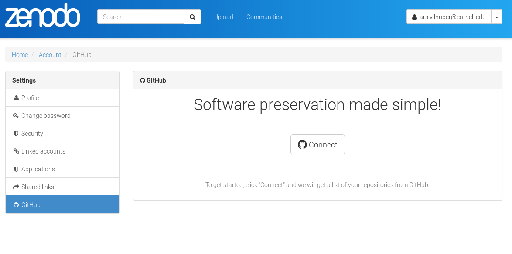
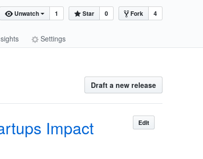
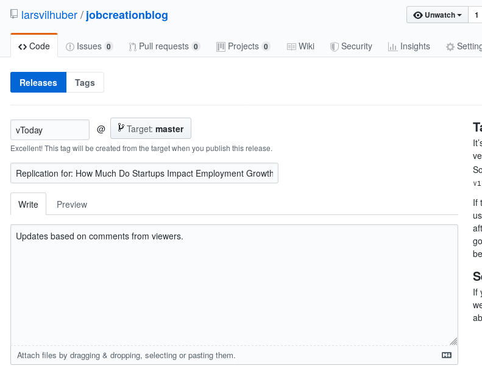
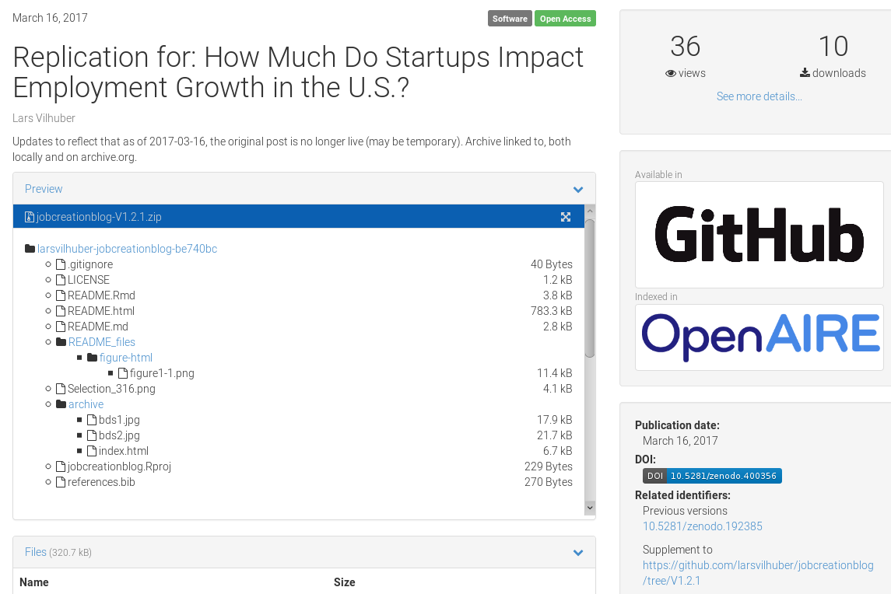

How to create an archive from your research project (RT2 2021)
========================================================
author: Lars Vilhuber
date: 2021-09-03
autosize: true
width: 1200

Cornell University

How to create an archive from your research project
==================================================
- Only works with Github (for now)
- Log on to Zenodo
- Go to [Account -> Settings -> Github](https://sandbox.zenodo.org/account/settings/github/)
- Connect your Github account

Create a release
==================================================

Create a release
==================================================

Automatically creates an archive on Zenodo
==================================================

***

Final result
============
The final result 

- pulls data from Zenodo
- reliably reproduces the graph as presented today
- uses citable data (`DOI = 10.5281/zenodo.2649598`)
- was achieved using replicable methods (before/ after is viewable)
- **is citable itself (`DOI = 10.5281/zenodo.400356`)**
- **is accessible (
https://larsvilhuber.github.io/jobcreationblog/README.html)**

